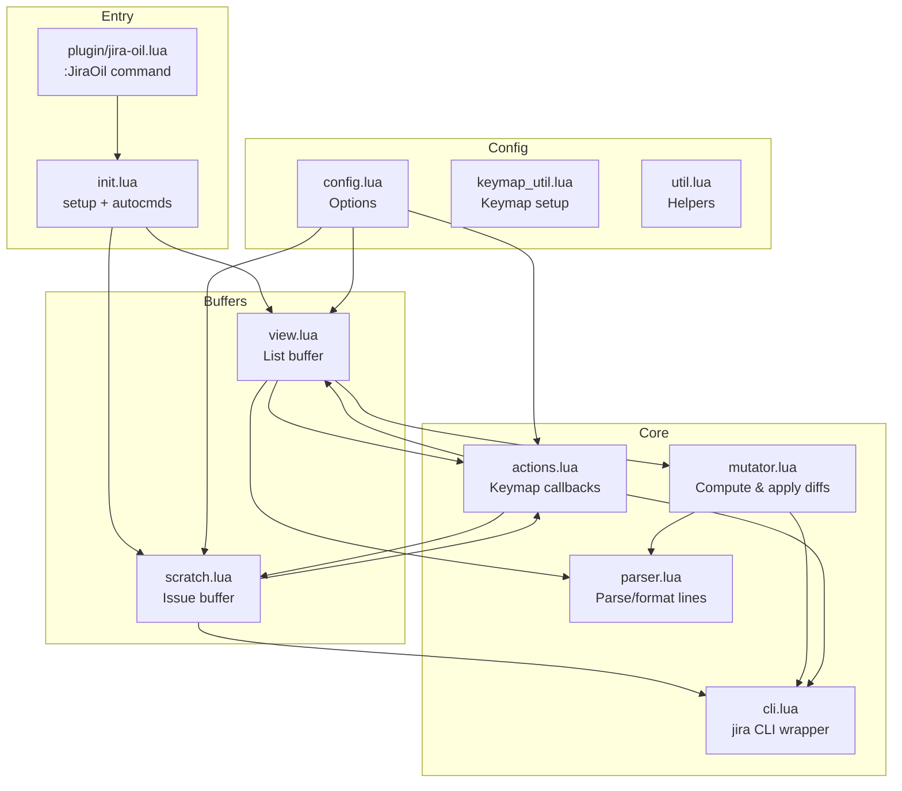

# jira-oil.nvim

Edit your Jira backlog and sprints like a regular Neovim buffer.

Inspired by [oil.nvim](https://github.com/stevearc/oil.nvim), this plugin gives
you a virtual "filesystem" for Jira tasks. View issues in a list, edit fields
inline, and save to dispatch changes. No more switching between browser tabs.

## Features

- **Buffer-as-Jira**: View sprint and backlog as a tabular list in a normal Neovim buffer
- **Inline Editing**: Change status, reassign, or edit summaries by editing text directly
- **Batch Mutations**: Make multiple changes, save, and confirm before execution
- **Task Copying**: Yank lines and paste to create new tasks from existing ones
- **Draft State**: Scratch buffer edits persist as drafts, shown with `[draft]` markers
- **Scratch Buffers**: Full issue details in a structured buffer with description editing
- **Epic & Components**: Pick epics and components interactively when editing issues
- **Icons**: Nerd Font icons for status and issue types

## Quick Start

1. Run `:JiraOil` to open sprint and backlog combined
2. Run `:JiraOil sprint` for sprint only, `:JiraOil backlog` for backlog only
3. Edit text in the Status or Assignee columns
4. Press `<C-s>` or `:w` to save. A floating window shows pending mutations
5. Press `Y` to confirm

To edit selected task, press <CR>.
To create a new task, press <C-c>.

## Prerequisites

This plugin wraps the official Jira CLI.

1. Install [ankitpokhrel/jira-cli](https://github.com/ankitpokhrel/jira-cli)
2. Authenticate with `jira init`
3. Verify `jira` works from your terminal

## Installation

Using [lazy.nvim](https://github.com/folke/lazy.nvim):

```lua
{
  "your-username/jira-oil.nvim",
  config = function()
    require("jira-oil").setup({
      defaults = {
        project = "PROJ", -- or set JIRA_PROJECT env var
      }
    })
  end
}
```

### Full lazy.nvim config (no personal data)

Use this as a complete starting point. Replace placeholder values (`PROJ`, `TEAM_JQL`, component names) in your local config.

```lua
{
  "your-username/jira-oil.nvim",

  -- Load on demand via keymaps
  keys = {
    {
      "<leader>jj",
      function()
        require("jira-oil").open("all")
      end,
      desc = "JiraOil: all",
    },
    {
      "<leader>js",
      function()
        require("jira-oil").open("sprint")
      end,
      desc = "JiraOil: sprint",
    },
    {
      "<leader>jc",
      function()
        require("jira-oil.scratch").open_new()
      end,
      desc = "JiraOil: create issue",
    },
  },

  config = function()
    require("jira-oil").setup({
      cli = {
        cmd = "jira",
        timeout = 10000,
        cache = {
          enabled = true,
          ttl_ms = {
            sprint_issues = 5000,
            backlog_issues = 5000,
            issue = 15000,
            epics = 30000,
          },
        },
        issues = {
          columns = { "key", "assignee", "status", "summary", "labels" },
          team_jql = "",          -- e.g. "assignee in membersOf('TEAM_JQL')"
          exclude_jql = "issuetype != Epic",
          status_jql = "",        -- e.g. "status != Closed"
        },
        epics = {
          args = { "issue", "list", "--type", "Epic" },
          columns = { "key", "summary", "status" },
          filters = { "-s~done", "-s~closed" },
          order_by = "created",
          prefill_search = "",
        },
        epic_issues = {
          args = { "issue", "list" },
          columns = { "type", "key", "assignee", "status", "summary", "labels" },
          filters = { "-s~done", "-s~closed" },
          order_by = "status",
          prefill_search = "",
        },
      },

      view = {
        columns = {
          { name = "status", width = 15 },
          { name = "assignee", width = 15 },
          { name = "summary" },
        },
        key_width = 12,
        default_sort = "key",
        show_winbar = true,
        sections = {
          show_count = true,
          sprint_label = "Sprint",
          backlog_label = "Backlog",
        },
        status_icons = {
          ["Open"]        = "\u{f10c} ",
          ["To Do"]       = "\u{f10c} ",
          ["In Progress"] = "\u{f144} ",
          ["In Review"]   = "\u{f06e} ",
          ["Done"]        = "\u{f058} ",
          ["Closed"]      = "\u{f058} ",
          ["Blocked"]     = "\u{f05e} ",
          default          = "\u{f111} ",
        },
        type_icons = {
          Task         = "\u{f0ae} ",
          Story        = "\u{f02d} ",
          Epic         = "\u{f0e7} ",
          ["Sub-task"] = "\u{f0ae} ",
          Bug          = "\u{f188} ",
          Improvement  = "\u{f0d0} ",
          Feature      = "\u{f0eb} ",
          default      = "\u{f016} ",
        },
      },

      keymaps = {
        ["g?"] = { "actions.show_help", mode = "n" },
        ["gR"] = { "actions.reset", mode = "n" },
        ["<CR>"] = "actions.select",
        ["<C-c>"] = { "actions.create", mode = "n" },
        ["gB"] = { "actions.open_in_browser", mode = "n" },
        ["<C-y>"] = { "actions.yank_issue_key", mode = { "n", "v" } },
        ["dd"] = { "actions.move_issue_to_other_section", mode = "n" },
        ["p"] = { "actions.paste_after", mode = "n" },
        ["P"] = { "actions.paste_before", mode = "n" },
        ["<M-r>"] = { "actions.refresh", mode = "n" },
        ["<C-q>"] = { "actions.close", mode = "n" },
        ["<C-s>"] = { "actions.save", mode = "n" },
      },
      keymaps_issue = {
        ["g?"] = { "actions.show_help", mode = { "n", "i" } },
        ["gR"] = { "actions.reset", mode = { "n", "i" } },
        ["<C-e>"] = { "actions.pick_epic", mode = { "n", "i" } },
        ["<C-o>"] = { "actions.pick_components", mode = { "n", "i" } },
        ["gB"] = { "actions.open_in_browser", mode = { "n", "i" } },
        ["<C-y>"] = { "actions.yank_issue_key", mode = { "n", "i" } },
        ["<C-q>"] = { "actions.close", mode = { "n", "i" } },
        ["<C-s>"] = { "actions.save", mode = { "n", "i" } },
      },
      use_default_keymaps = true,

      keymaps_help = {
        border = nil,
        show_title = true,
        show_footer = true,
        key_width = 18,
        separator = " \u{2502} ",
        max_width_ratio = 0.9,
        max_height_ratio = 0.8,
      },

      defaults = {
        project = vim.env.JIRA_PROJECT or "PROJ",
        assignee = vim.env.JIRA_USER or vim.env.JIRA_ASSIGNEE or "",
        issue_type = "Task",
        status = "Open",
      },

      -- Optional: set this only if your Jira tenant uses a custom epic field
      epic_field = "",

      create = {
        available_components = {
          "Backend",
          "Frontend",
          "API",
        },
      },
    })
  end,
}
```


## Usage

### List Buffer (`jira-oil://all`, `jira-oil://sprint`, `jira-oil://backlog`)

The list buffer shows a fixed-column layout with inline virtual text for issue keys:

```
PROJ-101 │ In Progress │ me   │ Fix the login bug
PROJ-102 │ To Do       │ john │ Update README
```

**Actions:**

- **Edit an issue**: Change text directly. "To Do" → "In Progress" queues a status transition
- **Create inline**: Type a new line with a summary. Empty key column means new task
- **Copy task**: Yank a line (`yy`), paste (`p` or `P`). The new task copies fields from the source
- **Move between sprint/backlog**: Press `dd` on an issue in the combined view. It is moved to the opposite section immediately and marked `[draft]` until saved
- **Open in browser**: `gB` opens the issue in your browser

### Scratch Buffer (`jira-oil://issue/PROJ-101`)

Press `<CR>` on an issue to open a structured scratch buffer:

```
Project:     PROJ
Epic:        PROJ-50: Authentication
Type:        Task
Components:  Backend
Status:      In Progress
Assignee:    me
──────────────────────────────
Fix the login bug

──────────────────────────────
When the user clicks login, it crashes...
```

Edit any field, including description. Save to push changes. Drafts are captured automatically and shown in the list buffer with `[draft]`.

Press `<C-c>` in the list buffer to create a new issue via scratch buffer.

### Draft State

When you edit a scratch buffer, changes are saved as drafts before you save to Jira. Draft indicators appear:

- `[draft]` in the scratch buffer winbar
- `[draft]` at the end of list buffer lines

Use `gR` to reset drafts and restore original values.

## Keymaps

### List Buffer

| Key | Action |
|-----|--------|
| `<CR>` | Open issue in scratch buffer |
| `<C-c>` | Create new issue (scratch buffer) |
| `<C-s>` | Save and confirm mutations |
| `<M-r>` | Refresh from Jira |
| `g?` | Show keymaps help |
| `gR` | Reset unsaved changes |
| `gB` | Open issue in browser |
| `<C-y>` | Yank issue key (works in visual mode) |
| `dd` | Move issue between Sprint/Backlog (marks draft) |
| `p` | Paste task copy after cursor |
| `P` | Paste task copy before cursor |
| `<C-q>` | Close buffer |

### Scratch Buffer

| Key | Action |
|-----|--------|
| `<C-s>` | Save changes to Jira |
| `<C-e>` | Pick epic (interactive selector) |
| `<C-o>` | Pick components (multi-select) |
| `g?` | Show keymaps help |
| `gR` | Reset to original values |
| `gB` | Open issue in browser |
| `<C-y>` | Yank issue key |
| `<C-q>` | Close buffer |

## Configuration

```lua
require("jira-oil").setup({
  cli = {
    cmd = "jira",
    timeout = 10000, -- ms
    issues = {
      columns = { "key", "assignee", "status", "summary", "labels" },
      team_jql = "",
      exclude_jql = "issuetype != Epic",
      status_jql = "",
    },
    epics = {
      args = { "issue", "list", "--type", "Epic" },
      columns = { "key", "summary", "status" },
      filters = { "-s~done", "-s~closed" },
      order_by = "created",
    },
    epic_issues = {
      args = { "issue", "list" },
      columns = { "type", "key", "assignee", "status", "summary", "labels" },
      filters = { "-s~done", "-s~closed" },
      order_by = "status",
    },
  },
  view = {
    columns = {
      { name = "status", width = 15 },
      { name = "assignee", width = 15 },
      { name = "summary" },
    },
    key_width = 12,
    default_sort = "key",
    show_winbar = true,
    sections = {
      show_count = true,
      sprint_label = "Sprint",
      backlog_label = "Backlog",
    },
    -- Nerd Font icons (Unicode escapes for portability)
    status_icons = {
      ["Open"]        = "\u{f10c} ",  -- ○
      ["To Do"]       = "\u{f10c} ",
      ["In Progress"] = "\u{f144} ",  -- ▶
      ["In Review"]   = "\u{f06e} ",  -- 👁
      ["Done"]        = "\u{f058} ",  -- ✓
      ["Closed"]      = "\u{f058} ",
      ["Blocked"]     = "\u{f05e} ",  -- ⊘
      default         = "\u{f111} ",  -- ●
    },
    type_icons = {
      Task         = "\u{f0ae} ",
      Story        = "\u{f02d} ",
      Epic         = "\u{f0e7} ",
      ["Sub-task"] = "\u{f0ae} ",
      Bug          = "\u{f188} ",
      Improvement  = "\u{f0d0} ",
      Feature      = "\u{f0eb} ",
      default      = "\u{f016} ",
    },
  },
  keymaps = {
    ["g?"] = { "actions.show_help", mode = "n" },
    ["gR"] = { "actions.reset", mode = "n" },
    ["<CR>"] = "actions.select",
    ["<C-c>"] = { "actions.create", mode = "n" },
    ["gB"] = { "actions.open_in_browser", mode = "n" },
    ["<C-y>"] = { "actions.yank_issue_key", mode = { "n", "v" } },
    ["dd"] = { "actions.move_issue_to_other_section", mode = "n" },
    ["p"] = { "actions.paste_after", mode = "n" },
    ["P"] = { "actions.paste_before", mode = "n" },
    ["<M-r>"] = { "actions.refresh", mode = "n" },
    ["<C-q>"] = { "actions.close", mode = "n" },
    ["<C-s>"] = { "actions.save", mode = "n" },
  },
  keymaps_issue = {
    ["g?"] = { "actions.show_help", mode = { "n", "i" } },
    ["gR"] = { "actions.reset", mode = { "n", "i" } },
    ["<C-e>"] = { "actions.pick_epic", mode = { "n", "i" } },
    ["<C-o>"] = { "actions.pick_components", mode = { "n", "i" } },
    ["gB"] = { "actions.open_in_browser", mode = { "n", "i" } },
    ["<C-y>"] = { "actions.yank_issue_key", mode = { "n", "i" } },
    ["<C-q>"] = { "actions.close", mode = { "n", "i" } },
    ["<C-s>"] = { "actions.save", mode = { "n", "i" } },
  },
  use_default_keymaps = true,
  keymaps_help = {
    border = nil,
    show_title = true,
    show_footer = true,
    key_width = 18,
    separator = " \u{2502} ",
    max_width_ratio = 0.9,
    max_height_ratio = 0.8,
  },
  defaults = {
    project = vim.env.JIRA_PROJECT or "",
    assignee = vim.env.JIRA_USER or vim.env.JIRA_ASSIGNEE or "",
    issue_type = "Task",
    status = "Open",
  },
  -- Optional: set if your Jira instance stores epic link in a custom field
  epic_field = "",
  create = {
    available_components = {}, -- List for component picker
  },
})
```

### Instance-Specific Configuration

These values usually depend on your Jira tenant. Keep them in your local Neovim config, not in this repository:

- `defaults.project` (example: `"PROJ"`)
- `cli.issues.team_jql` and `cli.issues.status_jql`
- `cli.epics.args` / `cli.epic_issues.args` if your team uses custom filters
- `create.available_components`
- `epic_field` if your Jira uses a custom field for Epic link

### Disabling Keymaps

Set any keymap to `false` to disable it:

```lua
keymaps = {
  ["<C-y>"] = false, -- Disable yank keymap
}
```

Set `use_default_keymaps = false` to start with no keymaps.

## Architecture



**Module responsibilities:**

| Module | Purpose |
|--------|---------|
| `init.lua` | Setup, autocmds for `jira-oil://` protocol, draft capture |
| `view.lua` | List buffer rendering, decorations, key virtual text |
| `scratch.lua` | Issue buffer, draft persistence, field pickers |
| `mutator.lua` | Diff computation, mutation execution |
| `cli.lua` | Async jira CLI execution, caching |
| `parser.lua` | Line parsing and formatting |
| `actions.lua` | All keymap callbacks |
| `config.lua` | Configuration defaults and merge |

## Troubleshooting

### "Invalid URI" or commands not found

Call `require("jira-oil").setup()` in your config. This registers the `jira-oil://` protocol handler.

### "Failed to create issue"

Check `jira issue list` works in your terminal. Verify your project key in the plugin config.

### Issue type or component picker shows nothing

Configure `create.available_components` with your team's components:

```lua
create = {
  available_components = { "Backend", "Frontend", "API" },
}
```

### Icons show as boxes or missing characters

Install a [Nerd Font](https://www.nerdfonts.com/) and configure your terminal to use it.

## License

MIT
